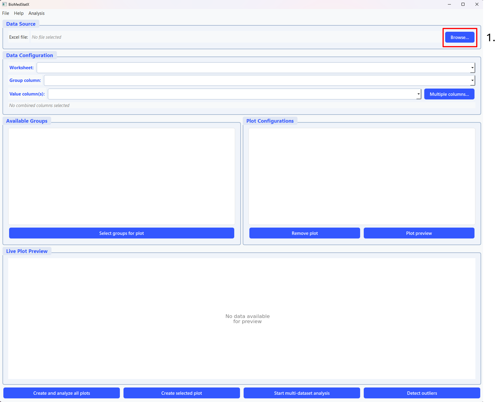
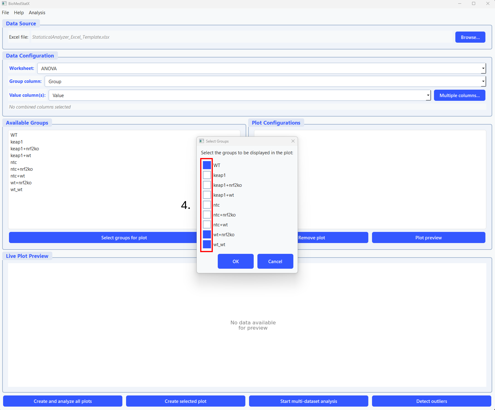
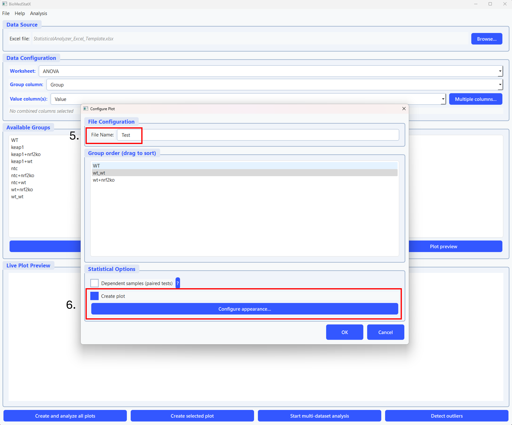
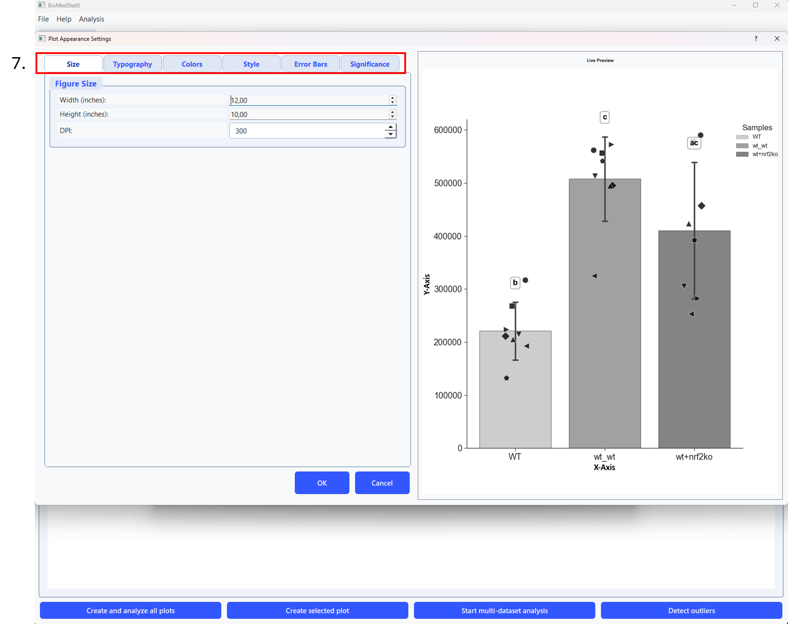
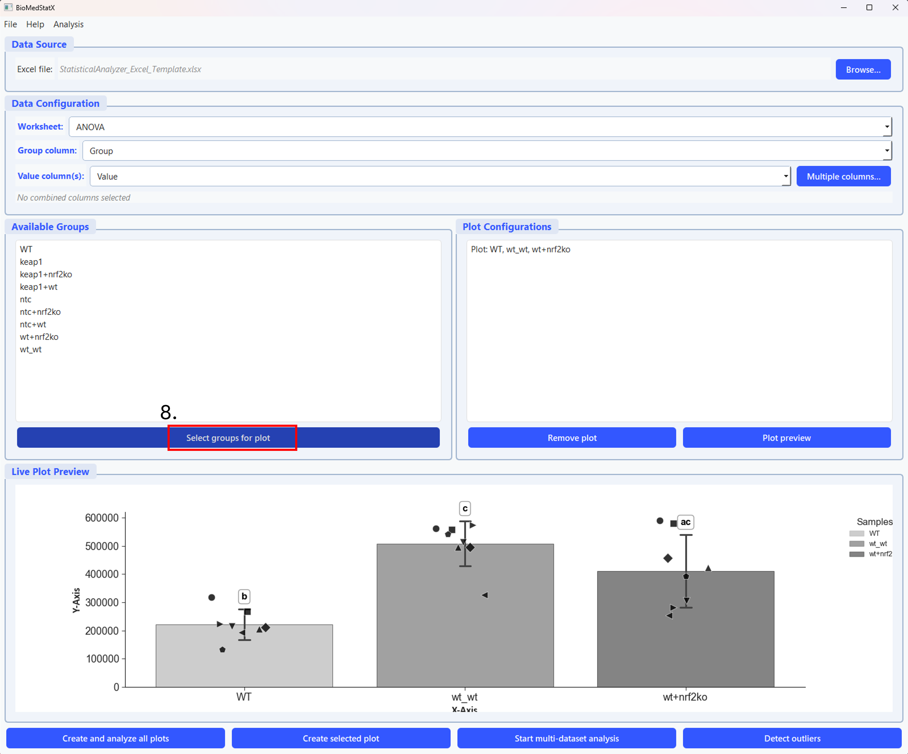
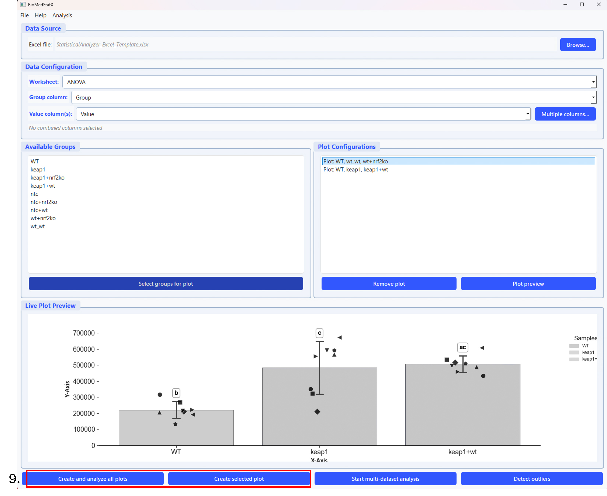
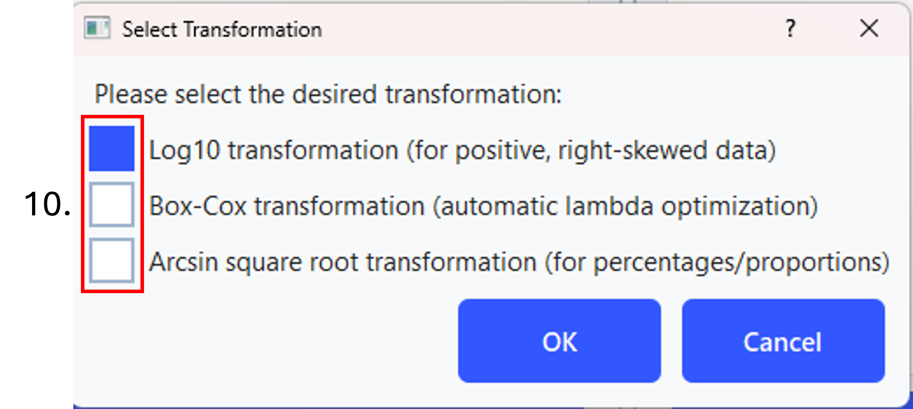

# BioMedStatX User Guide

This guide explains how to use the BioMedStatX application: from launching the program, importing data, running statistical analyses, customizing plots, and exporting results. All information is focused on the user interface, available statistics, and practical workflow—no programming or code knowledge required.

---

## 1. Launching the Application

- Locate the `BioMedStatX.exe` file in your installation directory.
- Double-click to start. A Qt-based GUI window will open with the menus: **File**, **Analysis**, and **Help**.
---

## 2. Importing Data

1. In the **File** menu, select **Browse** to choose your data file (Excel `.xlsx`/`.xls` or CSV `.csv`).
2. For Excel files, select the worksheet you want to analyze. For CSV, this step is skipped.
3. Click **Load** to import your data into the application.

**Step 1 (see number 1 in the picture):** Click the "Browse..." button (highlighted in red) in the top right to select your Excel or CSV data file. This is the first step in the workflow and starts the data import process.

## 3. Selecting Groups & Measurement Columns

**Step 2 (see numbers 2 and 3 in the picture):** First, select the worksheet, group column, and value column in the Data Configuration section (number 2 in the picture). Then, click the "Select groups for plot" button (number 3 in the picture) to choose which groups to include in your plot.

---

## 4. Assumption Checks & Data Transformations

Before any statistical test, the app automatically checks for normal distribution and equal variances. If your data does not meet these assumptions, you will be prompted to apply a transformation (log, Box–Cox, or arcsine–sqrt) to improve suitability for analysis. You can skip or accept the suggested transformation.

**Step 3 (see number 4 in the picture):** In the group selection dialog, select the groups you want to display in the plot by checking the boxes (number 4 in the picture). Then click "OK" to confirm your selection.

## 5. Statistical Analyses

BioMedStatX automatically selects the appropriate statistical test based on your data and design. Supported analyses include:

- Two-group comparisons (independent or paired)
- Multi-group comparisons (one-way, two-way, repeated measures, mixed designs)
- Parametric and non-parametric alternatives (e.g., t-tests, ANOVA, Mann–Whitney, Kruskal–Wallis)

You do not need to choose the test yourself—the software guides you and explains the result in plain language.

**Step 5:** The application automatically selects the appropriate statistical test. Click (1) to view details or options for the analysis. Click (2) to run the test and see the results.

---

### 5.1. Non-parametric Alternatives

If your data does not meet the requirements for standard ANOVA, the app will automatically use robust non-parametric alternatives for complex designs (e.g., non-parametric two-way or repeated measures ANOVA).

---

## 6. Post‑Hoc Comparisons

If a group comparison is significant, the app automatically performs post-hoc tests (e.g., Tukey, Dunn, Bonferroni, or Dunnett) to show which groups differ. Results are clearly displayed in the results table and as annotations on the plots.

**Step 6 (see number 8 in the picture):** If a group comparison is significant, select the desired post-hoc test (number 8 in the picture) to see which groups differ. Results are shown in tables and annotated on plots.

---

## 7. Decision Tree Visualization

You can visualize the statistical decision process via **Analysis → Show Decision Tree**. The app displays a graphical flowchart showing which tests were chosen and why, with the actual path highlighted. The image can be saved for documentation.

**Step 7 (see number 9 in the picture):** Click the button (number 9 in the picture) to open the decision tree visualization. The highlighted path shows which statistical tests were chosen and why. You can save the image for documentation.

---

## 8. Exporting Results

After your analysis, you can export all results to Excel with a single click (**File → Export Results**). The exported file contains:
- A summary of all tests and p-values
- Assumption checks
- Main results and effect sizes
- Descriptive statistics for each group
- The decision tree image
- Raw data snapshots
- Pairwise comparisons
- A chronological analysis log
Each sheet is clearly named for easy navigation.

**Step 8 (see number 10 in the picture):** Click the button (number 10 in the picture) to export all results to Excel. Choose the export location and confirm. The exported file contains all analysis details and results.

---

## 9. Plotting & Customization

BioMedStatX creates publication-ready plots for your results. Supported plot types include:
- Bar charts (with error bars)
- Violin plots
- Boxplots
- Overlayed individual data points (with lines for paired data)

### Plot Customization

Use the **Plot Settings** dialog to adjust:
- Plot title and axis labels
- Figure size (width, height, DPI)
- Colors and hatches for each group
- Error bar style (SD/SEM, caps/lines)
- Significance annotations (letters, brackets, custom comparisons)
- Legend position, font size, and title
- Background and grid style
- Data point style (jitter, strip, swarm)
- Overlay options (paired lines, custom annotations)

**Step 9 (see number 11 in the picture):** Click the button (number 11 in the picture) to open the plot settings dialog. Adjust titles, axis labels, colors, error bars, and more. Preview changes and save or export the customized plot.

All changes are shown in a live preview before saving. Most options are also available for export (PDF/PNG) and are reflected in the exported plots.

**Note:** Some advanced customizations (e.g., custom color maps or font families) may require the advanced options dialog.

---

## 10. Outlier Detection (Optional)

Under **Analysis → Detect Outliers**, you can identify and flag outliers in your data using:
- Modified Z-Score Test
- Grubbs’ Test
- Single-pass or iterative mode

Results are exported to Excel for further review.

---

## 11. Window Resizing, Scrollability, and Scaling

BioMedStatX is designed to work on all common screen sizes and resolutions:
- All windows and dialogs can be resized by dragging the edges.
- Dialogs are scrollable if content does not fit on the screen.
- The layout adapts to high-DPI screens and multi-monitor setups.
- Minimum and maximum window sizes ensure usability on both small and large screens.

**Tips:**
- If you cannot see all content, maximize the window or use the scrollbars.
- On very high-resolution screens, use your operating system’s scaling settings or adjust the app’s DPI settings (see Help menu).
- For best results, keep your graphics drivers and system libraries up to date.

If you encounter display issues, please report your OS, screen resolution, and a screenshot to the developer.

---

## 12. Quick Workflow

1. **Launch** the application.
2. **Browse** and **Load** your data file.
3. **Select** worksheet (if Excel), group column, and measurement columns.
4. **Choose** analysis type (basic or advanced).
5. **Check** assumptions; apply transforms if needed.
6. **Review** plots and decision tree.
7. **Export** results; locate your results files in your working folder.

**Step 10:** Follow the numbered steps in the screenshot to complete a typical analysis workflow: launch the app, load data, select groups and measurements, run analyses, review results, customize plots, and export everything.

---

---

---

### Tips & Best Practices

- Ensure your group column has consistent, non-empty labels.
- Use data transformations for highly skewed data if prompted.
- For paired designs, confirm equal sample sizes per group.
- Use the **Analysis Log** sheet in the exported Excel file for troubleshooting and detailed steps.
- Preview your plot settings before exporting for best results.
- If you encounter issues with window scaling or content visibility, maximize the window or adjust your OS scaling settings.

---

Happy analyzing!